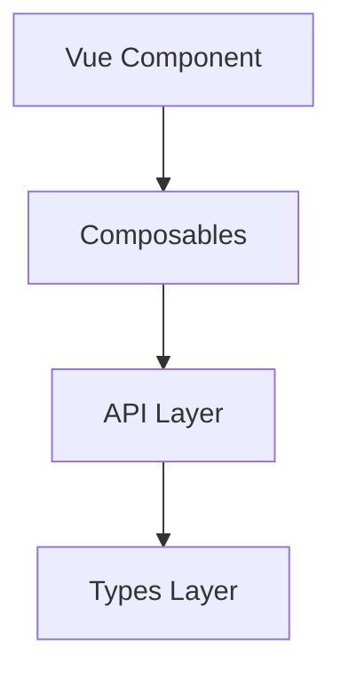

# AI Agent Rule: Strict Separation of Concerns (SoC)

This document enforces absolute isolation between the UI Presentation layer, Business Logic layer, Network layer, and Type definition layer across this codebase.

## 1. Core Architectural Layers

Every component, function, and file must be strictly separated into its assigned layer.

### Vue Components (`.vue`)
- **UI composition and orchestration ONLY.**
- **NO business logic allowed** inside setup scripts or templates.
- **NO API calls allowed** directly.
- **NO TypeScript interface definitions** allowed (must import from `/types`).
- **NO complex data transformation allowed** (must rely on computed or composables).
- **ONLY UI bindings, computed variables, and native UI events** handling.

### Composables (`src/composables/`)
- **ALL business logic MUST reside here.**
- **State management logic included.**
- **Reusable and encapsulated logic ONLY.**
- **MUST return reactive values only** (`Ref`, `ComputedRef`, or reactive objects).

### API Layer (`src/api/`)
- **ALL HTTP requests MUST reside here.**
- **NO axios / fetch triggers** outside this layer.
- **MUST return strictly typed responses** only.

### Types Layer (`src/types/`)
- **ALL TypeScript interfaces and custom types MUST be defined here.**
- **NO inline interface declarations** allowed inside `.vue` or local component scripts.
- **Shared, explicit, and self-documenting types only.**

### Styles Layer (`src/assets/scss/`)
- **ALL styling MUST be fully separated from presentation logic.**
- **NO inline `style="..."` usage** in Vue templates.
- **Prefer scoped styles or structured SCSS variables.**

---

## 2. Dependency Flow Rule

You must strictly adhere to the allowed dependency direction. Reverse flows are strictly forbidden:

**Vue Components ➔ Composables ➔ API ➔ Types**

---

## 3. Automation Refactoring Rule

If any structural violation of these rules is detected inside any file:
1. Extract all underlying logic routines into a dedicated Composable.
2. Relocate all custom interfaces into the central `/types` directory.
3. Centralize HTTP request mappings under `/api`.
4. Purge all direct logic out of the presentation layer.

---

## 4. Async Collection Loading UX

Any page that loads a collection from a remote API MUST expose the request state in the UI.

- On the initial request, render a skeleton that resembles the final list or card layout.
- If previously validated data is already visible during a refresh, keep it visible and show a non-blocking progress indicator.
- End the loading state in a `finally` path so success, empty responses, and failures cannot leave the UI stuck.
- Preserve and display a validated local snapshot when the remote request fails.
- Loading indicators MUST include an accessible status message and respect `prefers-reduced-motion`.
